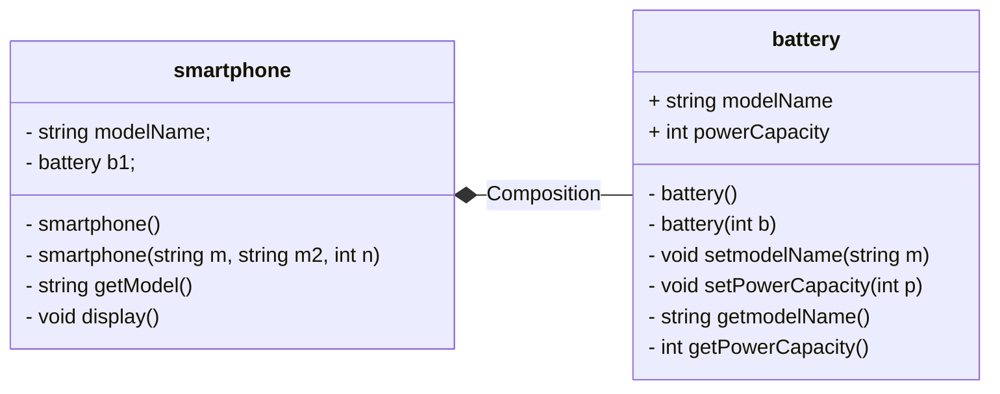
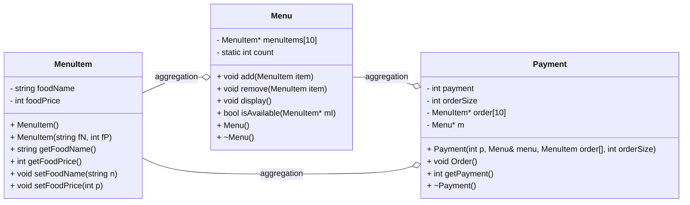
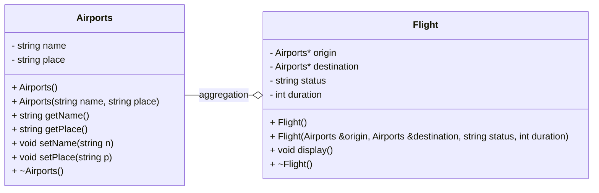

## Q2

```mermaid
classDiagram
    direction RL
    battery --* smartphone : Composition

    class battery{
        + string modelName
        + int powerCapacity
        - battery()
        - battery(int b)
        - void setmodelName(string m)
        - void setPowerCapacity(int p)
        - string getmodelName()
        - int getPowerCapacity()
    }
    
    class smartphone{
        - string modelName;
        - battery b1;

        - smartphone()
        - smartphone(string m, string m2, int n)
        - string getModel()
        - void display()
    }
```

## Q3

```mermaid
classDiagram
    direction RL
    Menu o-- MenuItem : aggregation
    Payment o-- Menu : aggregation
    Payment o-- MenuItem : aggregation

    class MenuItem {
        - string foodName
        - int foodPrice
        + MenuItem()
        + MenuItem(string fN, int fP)
        + string getFoodName()
        + int getFoodPrice()
        + void setFoodName(string n)
        + void setFoodPrice(int p)
    }

    class Menu {
        - MenuItem* menuItems[10]
        - static int count
        + void add(MenuItem item)
        + void remove(MenuItem item)
        + void display()
        + bool isAvailable(MenuItem* mI)
        + Menu()
        + ~Menu()
    }

    class Payment {
        - int payment
        - int orderSize
        - MenuItem* order[10]
        - Menu* m
        + Payment(int p, Menu& menu, MenuItem order[], int orderSize)
        + void Order()
        + int getPayment()
        + ~Payment()
    }
```

## Q4

```mermaid
classDiagram
direction RL
    Flight o-- Airports : aggregation

    class Airports {
        - string name
        - string place
        + Airports()
        + Airports(string name, string place)
        + string getName()
        + string getPlace()
        + void setName(string n)
        + void setPlace(string p)
        + ~Airports()
    }

    class Flight {
        - Airports* origin
        - Airports* destination
        - string status
        - int duration
        + Flight()
        + Flight(Airports &origin, Airports &destination, string status, int duration)
        + void display()
        + ~Flight()
    }
```