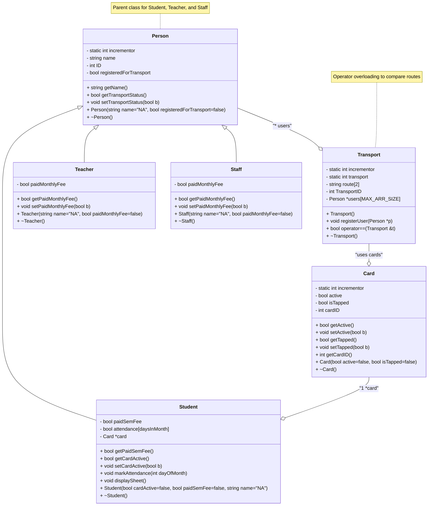

# Q1
We're gonna be picking up where we left off in the last assignment: FAST's Transportation
System.
For this scenario, you are required to revisit the system, and update it according to the newer
concepts that we have discussed. It should include the following concepts: 
- Inheritance,
- Constructor Chaining, 
- Polymorphism (static/dynamic), 
- Operator Overloading, etc.

## Things to consider:
- Introduce new classes, 
  - such as teacher and staff members who can also avail the transport. 
  - Is there a parent class that can encompass some of the functionalities for students, teachers and staff members? Are some functionalities different between users? 
    - For example, students pay on a semester-by-semester basis, and teachers pay on a monthly basis.
- Can you perform operator overloading to verify if two objects are the same or not? 
  - If so, demonstrate it in your classes. 
    - For example; are two routes the same?

Feel free to refer to the question # 4 from the previous assignment for functionalities that you
have used.

----------------------------------------------------------------------
Now, keeping all these things in mind, show what your updated class diagram looks like (show
inheritance, aggregation and composition clearly). And update your previous code accordingly.

