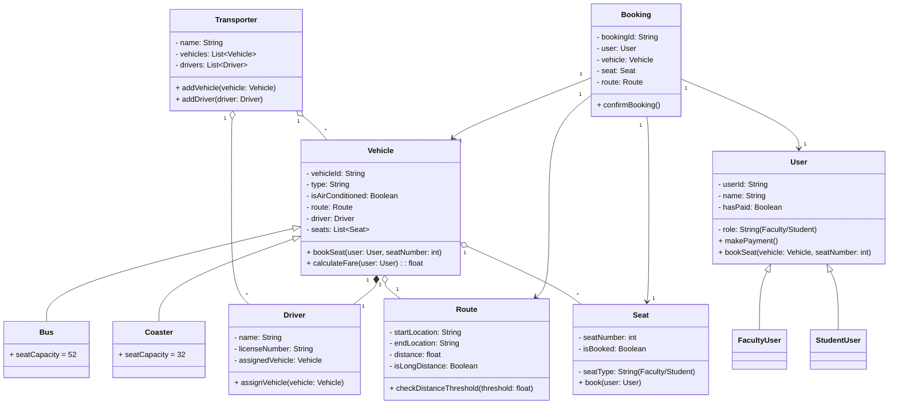

```mermaid

classDiagram
    class Transporter {
        - name: String
        - vehicles: List~Vehicle~
        - drivers: List~Driver~
        + addVehicle(vehicle: Vehicle)
        + addDriver(driver: Driver)
    }

    class Vehicle {
        - vehicleId: String
        - type: String
        - isAirConditioned: Boolean
        - route: Route
        - driver: Driver
        - seats: List~Seat~
        + bookSeat(user: User, seatNumber: int)
        + calculateFare(user: User): float
    }

    class Bus {
        + seatCapacity = 52
    }

    class Coaster {
        + seatCapacity = 32
    }

    class Seat {
        - seatNumber: int
        - isBooked: Boolean
        - seatType: String (Faculty/Student)
        + book(user: User)
    }

    class Driver {
        - name: String
        - licenseNumber: String
        - assignedVehicle: Vehicle
        + assignVehicle(vehicle: Vehicle)
    }

    class Route {
        - startLocation: String
        - endLocation: String
        - distance: float
        - isLongDistance: Boolean
        + checkDistanceThreshold(threshold: float)
    }

    class User {
        - userId: String
        - name: String
        - role: String (Faculty/Student)
        - hasPaid: Boolean
        + makePayment()
        + bookSeat(vehicle: Vehicle, seatNumber: int)
    }

    class FacultyUser {
    }

    class StudentUser {
    }

    class Booking {
        - bookingId: String
        - user: User
        - vehicle: Vehicle
        - seat: Seat
        - route: Route
        + confirmBooking()
    }

    %% Inheritance
    Vehicle <|-- Bus
    Vehicle <|-- Coaster
    User <|-- FacultyUser
    User <|-- StudentUser

    %% Relationships
    Transporter "1" o-- "*" Vehicle
    Transporter "1" o-- "*" Driver
    Vehicle "1" *-- "1" Driver
    Vehicle "1" o-- "1" Route
    Vehicle "1" o-- "*" Seat
    Booking "1" --> "1" User
    Booking "1" --> "1" Vehicle
    Booking "1" --> "1" Seat
    Booking "1" --> "1" Route
```