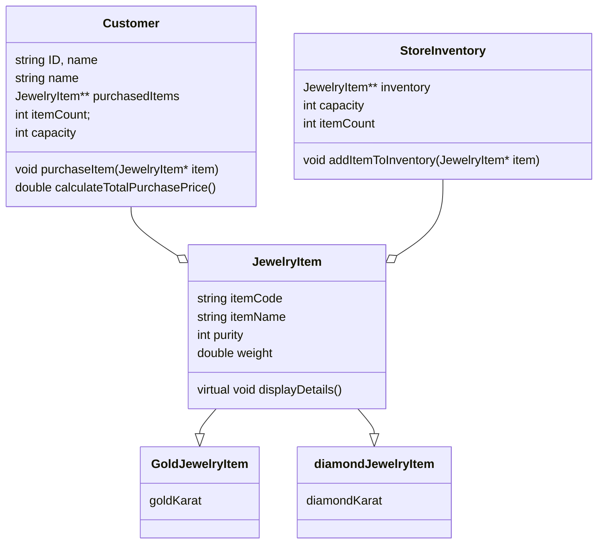

source : file:///D:/rafay/Oop%20theory%202024[1].pdf

# OOP 2024

## Q1: Write short answers (2-3 lines) for the following questions:
 
### a
What is the difference between compile-time error and runtime error? Which types of errors can be dealt with using exceptions? 

- in compile time error, 
  - the error occurs when the compiler is trying to make an executable of the code
  - usually done by syntax errors present in the code
- in runtime error,
  - the error ueusally occurs when the program is running
  - due to some error in the input, error in memory
- excpetion handling can only deal with runtime errors


### b
Which principle of object-oriented programming suits in the below scenarios? 

#### 1. 
A bank vault with multiple layers of security protecting valuable assets. 


- encapsulation


#### 2. 
A car with different driving modes for different road conditions. 

- polymorphism

### c
Write an advantage of using overloading instead of generics in C++? 

- overloading allows redefination of completely different implementations
- 

### d
Can a friend function of Base class access the data members of a derived class? 

- no a friend function is only tied to the base class the friendship is not inherited by the inherited classes otherwise it will violate the rule of encapsulation

### e
If class C inherits class B and class B inherits class A, then Class C object can be upcasted to object of 
either class A or B?

- class C can be upcasted by both b and a

## Question 2: 

### A.  
```cpp
class Test 
{ public: Test() { cout <<"Hello from Test() "; } 
} a; 
int main() 
{ cout <<"Main Started "; } 
```

- the a desbribed afer the class Test

### B.  
```cpp
class Test { 
public: 
   Test() { cout << "Constructing an object of Test " << endl; } 
  ~Test() { cout << "Destructing an object of Test "  << endl; } 
}; 
int main() { 
  try { 
    Test t1; 
    throw 10; 
  } catch(int i) { cout << "Caught " << i << endl; } } 
``` 

Constructing an object of Test 
Destructing an object of Test 

### C.  
```cpp
template <typename T> 
void fun(const T&x) 
{   static int count = 0; 
    cout << "x = " << x << " count = " << count; 
    ++count; 
    return; 
} 
int main() 
{ 
    fun<int> (1); cout << endl; 
    fun<int>(1); cout << endl; 
    fun<double>(1.1); cout << endl; 
} 
```

x = 1 count = 0
x = 1 count = 1
x = 1.1 count = 0

- for fun with int  
  - like this `fun<int>`
  - count is 0 then staticlly incremented to 1
- for fun with double 
  - like this `fun<double>`
  - count is then 0 again


### D.  

```cpp
int main() { 
try { 
     cout<<"Throwing Block"<<endl; 
    throw 'x'; 
} 
catch (int e) { 
cout <<"Catching Int" << e << endl; } 
catch (...) { 
cout <<"Catching Default" << endl; } 
catch (char e) { 
cout <<"Catching Char" << e << endl; } 
 return 0;} 
```

- catch (...) should be in last


### E.  

```cpp
char foo(int i) { 
    if (i % 3 != 0) 
        return 't'; 
    throw 'o'; 
    return 'p'; 
} 
int main() { 
    char c = 'c'; 
    try { 
        for (int i = 1; ; i++) { c = foo(i); cout << "c" << endl;} 
   } 
    catch (char ex) { 
        cout << c << endl; cout << ex << endl; } } 

```

c c t o


## 3: 
Complete the C++ code for an Object-Oriented Programming (OOP) scenario. 
                    
### A. 
For the given class, you are required to create a specialized template that manages computations  specifically when both arrays are characters with a size of 10. Overload the function so that it returns a string containing all elements of arr1 followed by all elements of arr2. 

``` cpp

template <class T, int size>  
class QuestionTemplate { 
    T arr1[size]; 
    T arr2[size]; 
public: 
    QuestionTemplate() { 
        //assume numbers only for now 
        for (int i = 0; i < size; i++){ 
            arr1[i] = i; 
            arr2[size - i - 1] = i; 
        } 
    } 
    T* add() { 
      T* arr = new T[size]; 
        for (int i = 0; i < size; i++) 
            arr[i] = arr1[i] + arr2[i]; 
        return arr; 
    } 
}; 

template <int size>
class QuestionTemplate<char, size>{
  
  char arr1[size];
  char arr2[size];

public:

  QuestionTemplate() { 
    //assume numbers only for now 
      for (int i = 0; i < size; i++){ 
        arr1[i] = 'a'; 
          arr2[size - i - 1] = 'b'; 
      } 
  } 
  
  char* add(){
    char* arr = new char[2*size];
    for (int i = 0; i < size; i++){
      arr[i] = arr1[i];  
    } 
    for (int i =0 ; i < size; i++){
      arr[i+size] = arr2[i]; 
    } 
      return arr;
  }
  

};

 
int main() { 
    QuestionTemplate <int, 10> qt; 
    int* res = qt.add(); 
    for (int i = 0; i < 10; i++) 
        cout << res[i] << endl; 
    QuestionTemplate <char, 10> ct; 
    cout << ct.add(); 

}
```

### B.

Complete the given code below in such a way that when we run this code, a similar kind of output is 
stored in the file. 

```cpp
outfile.txt: 
ID = 1, Name = 0001 
ID = 2, Name = 0002 
 
class Test { 
    int ID; 
    string name; 
    static int genID; 
public: 

  Test{
    genID++;
    ID = genID;
    name = "000"+ to_string(genID);
  };

  void operator+ (string file){
    ofstream oFile(file,ios::app);

    oFile <<"ID = "<<this->ID<<", Name = "<<this->name<<"\n";
    oFile.close();
  }

}; 
 
int Test::genID = 0; 
 
int main() { 
    Test t1, t2; 
    t1 + "outfile.txt"; 
    t2 + "outfile.txt"; 
} 
```


## 4.
Sui  Southern  Gas  Company  (SSGC)  is  one  of  the  leading  natural  gas  utility  companies  in  Pakistan, 
responsible for distributing natural gas to various regions. As part of its operations, SSGC maintains a fleet of 
vehicles for meter reading, pipeline inspection, and maintenance tasks. To enhance operational efficiency and 
ensure proper management of the fleet, SSGC has decided to implement a Fleet Management System (FMS). 
This system will track  vehicle  locations, monitor fuel consumption, analyze  driver performance,  and manage 
maintenance logs.

### A. 
Create **TelemetryData Class** simulated telemetry data for vehicles , including attributes : 
- The amount  of fuel consumed by the vehicle, 
- Fuel Consumption (liters per hour),
- The current speed of the vehicle peed (kilometers per hour).
- The status of the vehicle's engine Engine Status(true if running, false otherwise). 

### B. 

Design a **Vehicle Class** to store the vehicle details, including attributes 
- Vehicle ID ("V1234") ,
- Model ("Toyota Corolla 2022").
- Fuel Type ("Petrol" or "Diesel"), 
- Current Location ("Karachi") and 
- Instance of Telemetry Data class  

Implement the functions as described below 
- `Virtual displayDetails()`: Displays detailed information about the vehicle, including its 
  - ID, 
  - model, 
  - fuel type, 
  - current location, and 
  - telemetry data . 

- `updateLocation(const string& newLocation)`: Updates the current location of the vehicle with 
the provided new location. 
-  getVehicleID() const: Retrieves the unique identifier of the vehicle. 
### C. 
Create a friend class of vehicle as VehicleManager Class: Responsible for tracking the location of 
vehicles using trackVehicleLocation(Vehicle& vehicle): Tracks the location of a vehicle and displays the 
current location of the vehicle with its ID. 
i. Create function WriteToFile(vehicle * vehiclesArray): writes the details of all vehicles provided 
to a file named "vehicle_info ".  
b. Create function ReadFromFile(): Read those vehicle from file whose location is Karachi. 
### D. 
MeterReadingVehicle Class Subclass of Vehicle, representing a vehicle used specifically for meter 
reading include attributes Reading Capacity( int), Overrides displayDetails() to display  reading capacity. 
### E. 
PipelineInspectionVehicle Class:Subclass of Vehicle, representing a vehicle used for pipeline inspection 
include attribute InspectionRange(int), Overrides displayDetails() to dispay inspection range. 
### F. 
MaintenanceVehicle Class: Subclass of Vehicle Represents a vehicle used for maintenance purposes, 
include attribute Equipment Capacity (int): Capacity of the vehicle to carry maintenance equipment, 
measured in units. Overrides displayDetails() to include equipment capacity

```cpp

#include <iostream>
#include <fstream>

using namespace std;

class TelemetryData{

  float fuel, fuelConsumption,speed;
  bool engineStatus;

public:

    void displayDetails(){
        std::cout << "fuel:" << fuel << std::endl;        
        std::cout << "fuelConsumption:" << fuelConsumption << std::endl;        
        std::cout << "speed:" << speed << std::endl;        
        std::cout << "engineStatus: " << engineStatus << std::endl;        

    }
};

class Vehicle{

  string ID,model,fuelType,location;
  TelemetryData data;

public:

    virtual void displayDetails(){
        std::cout << "ID:" << ID << std::endl;
        std::cout << "model:" << model << std::endl;
        std::cout << "fuelType:" << fuelType << std::endl;
        std::cout << "location:" << location << std::endl;
        data.displayDetails();
        
    }

    void updateLocation(const string& newLocation){
        location = newLocation;
    }

    string getVehicleID() const{return this->ID;}
    friend class VehicleManager;
};

class VehicleManager{
public:
    string trackVehicleLocation(Vehicle& v){
        return v.location;

    }
    void WriteTOFile(Vehicle *VehicleArray){
        ofstream oFile("vehicle_info.txt",ios::app);
        oFile << VehicleArray << endl;
        oFile.close();
    }

};

class MeterReadingVehicle : Vehicle
{
    int capacity;
public:
    MeterReadingVehicle(int c = 0): capacity(c){}

    void displayDetails() override{
        Vehicle::displayDetails();
        std::cout << "capacity: "<< capacity << std::endl;

    }
    
};

class PipelineInspectionVehicle : Vehicle
{
    int InspectionRange;
public:
    PipelineInspectionVehicle(int I = 0): InspectionRange(I){}

    void displayDetails() override{
        Vehicle::displayDetails();
        std::cout << "InspectionRange: "<< InspectionRange << std::endl;

    }
    
};

class MaintenanceVehicle : Vehicle
{
    int EquipCapacity;
public:
    MaintenanceVehicle(int E = 0): EquipCapacity(E){}

    void displayDetails() override{
        Vehicle::displayDetails();
        std::cout << "EquipCapacity: "<< EquipCapacity << std::endl;

    }
    
};

int main(){

    MeterReadingVehicle meterVehicle;
    std::cout << "MeterReadingVehicle details:" << std::endl;
    meterVehicle.displayDetails();
    std::cout << std::endl;

    // Test PipelineInspectionVehicle
    PipelineInspectionVehicle pipelineVehicle;
    std::cout << "PipelineInspectionVehicle details:" << std::endl;
    pipelineVehicle.displayDetails();
    std::cout << std::endl;

    // Test MaintenanceVehicle
    MaintenanceVehicle maintenanceVehicle;
    std::cout << "MaintenanceVehicle details:" << std::endl;
    maintenanceVehicle.displayDetails();
    std::cout << std::endl;

    // Test VehicleManager's trackVehicleLocation (using friend access)
    VehicleManager manager;
    Vehicle v;
    v.updateLocation("TestLocation");
    std::cout << "Tracked location: " << manager.trackVehicleLocation(v) << std::endl;


    return 0;
}


```

Q5: Imagine you have been asked to develop a system for managing the Jewelry shop using Object-Oriented 
Programming (OOP) concepts. The system should handle various types of jewelry items, customer transactions, 
and inventory management. Consider the following detailed requirements for the system:  
                                        [45 minutes, 6*4+6=30 marks] 
1. JewelryItem Class (Abstract): 
-  Create an abstract class called JewelryItem. 
-  Attributes: itemCode (string), itemName (string), weightInGrams (double), purity (int). 
-  Methods:  
   - virtual void displayDetails(): Display the details of the jewelry item including item code, item 
name, weight, and purity. 
   - virtual double calculatePrice(): Calculate and return the price of the jewelry item based on weight and purity. 
1. GoldJewelry Class (Derived from JewelryItem): 
- Inherits from the JewelryItem class. 
- Additional Attribute: goldKarat (int). 
- Methods: 
  -  void setGoldKarat(int karat): Set the gold karat value for the item. 
  - Override calculatePrice() to calculate the price based on weight, purity, and gold karat. 
1. DiamondJewelry Class (Derived from JewelryItem): 
- Inherits from the JewelryItem class. 
- Additional Attribute: numDiamonds (int), diamondCarat (double). 
- Methods: 
  - void addDiamonds(int num, double carat): Add diamonds to the jewelry item with the specified 
carat weight. 
  - Override calculatePrice() to calculate the price based on weight, purity, and diamond carat 
weight. 
1. Customer Class: 
- Create a class called Customer to represent customers visiting the jewelry store. 
- Attributes:  customerID  (string),  name  (string),  purchasedItems  (dynamic  pointer  to  JewelryItem 
objects). 
- Methods: 
  - void  purchaseItem(JewelryItem*  item):  Add  a  purchased  item  to  the  customer's  list of 
purchased items. 
  - double calculateTotalPurchasePrice(): Calculate the total price of all purchased items. 
1. StoreInventory Class: 
- Create a class called StoreInventory to manage the store's inventory of jewelry items. 
- Attributes: inventory (dynamic pointer to JewelryItem objects). 
- Methods: 
  - void addItemToInventory(JewelryItem* item): Add a jewelry item to the store's inventory. 
  - void displayInventory(): Display the details of all items in the inventory. 
1. Operator Overloading: 
- Overload the comparison operators (<, >, ==) for JewelryItem objects based on their price (calculated 
using calculatePrice()). 
1. Draw UML/Class Diagram of the requirements given above. 

```cpp


#include <iostream>
#include <fstream>

using namespace std;

class JewelryItem{
protected:
    string itemCode,itemName;
    int purity;
    double weight;
public:


    JewelryItem(const string &code, const string &name, int p, double w){
        itemCode = code;
        itemName = name;
        purity = p;
        weight = w;
    }

    virtual void displayDetails(){
        std::cout << "itemCode: " << itemCode << std::endl;
        std::cout << "itemName: " << itemName << std::endl;
        std::cout << "purity: " << purity << std::endl;
        std::cout << "weight: " << weight << std::endl;
    }

    virtual double calcPrice() = 0;

    bool operator <(JewelryItem &other){
        return this->calcPrice() < other.calcPrice();
    }
    bool operator >(JewelryItem &other){
        return this->calcPrice() > other.calcPrice();
    }
    bool operator ==(JewelryItem &other){
        return this->calcPrice() == other.calcPrice();
    }

};

class GoldJewelryItem : public JewelryItem {
protected:
    int goldKarat;

public:

    GoldJewelryItem(const string &code, const string &name, int p, double w, int g): JewelryItem(code,name,p,w)
    {
        goldKarat  = g; 
    }

    void set_goldKarat(int k) {
        goldKarat =  k;
    }

    double calcPrice() override{
        return goldKarat*purity*weight;
    }

    void displayDetails() override{
        JewelryItem::displayDetails();
        std::cout << "goldKarat: " << goldKarat << std::endl;
    }
};


class DiamondJewelryItem : public JewelryItem {
protected:  
    int diamondKarat;
    
public:

    DiamondJewelryItem(const string &code, const string &name, int p, double w, int d): JewelryItem(code,name,p,w)
    {
        diamondKarat  = d; 
    }

    void set_karat(int k) {
        diamondKarat =  k;
    }
    void displayDetails() override{
        JewelryItem::displayDetails();
        std::cout << "diamondKarat: " << diamondKarat << std::endl;
    }

    double calcPrice() override{
        return diamondKarat*purity*weight;
    }


};


class Customer
{
private:
    string ID, name;
    JewelryItem** purchasedItems;
    int itemCount; // puchased item metric
    int capacity; // puchased item metric

public:
    Customer(const string &id, const string &n, int cap = 2)
        : ID(id), name(n), itemCount(0), capacity(cap){}

    void purchaseItem(JewelryItem* item) {
        if (itemCount >= capacity) {
            // Increase capacity by reallocating a larger array
            int newCapacity = capacity * 2;
            JewelryItem** temp = new JewelryItem*[newCapacity];
            for (int i = 0; i < itemCount; i++) {
                temp[i] = purchasedItems[i];
            }
            delete[] purchasedItems;
            purchasedItems = temp;
            capacity = newCapacity;
        }
        purchasedItems[itemCount++] = item;
    }
    double calculateTotalPurchasePrice(){
        double total = 0;
        for (size_t i = 0; i < itemCount; i++)
        {
            total = purchasedItems[itemCount]->calcPrice();
        }
        return total;
    }
    

    ~Customer(){
        for (size_t i = 0; i < itemCount; i++)
        {
            delete purchasedItems[i];
        }
        delete[] purchasedItems;
    }
};


class StoreInventory
{
private:
    JewelryItem** inventory;
    int capacity, itemCount;
public:
    StoreInventory(int cap = 2)
        : capacity(cap), itemCount(0)
    {
        inventory = new JewelryItem*[capacity];
    }

    void addItemToInventory(JewelryItem* item){

        if(itemCount>=capacity){
            int newCapacity = capacity *2;
            JewelryItem** temp = new JewelryItem*[newCapacity];
            // copy all items from inventory to temp
            for (size_t i = 0; i < itemCount; i++)
            {
                temp[i] = inventory[i];
            }
            delete[] inventory;
            inventory = temp;
            capacity = newCapacity;
            
        }
        inventory[itemCount++] = item;
    }

    void displayInventory(){
        for (size_t i = 0; i < itemCount; i++)
        {
            inventory[i]->displayDetails();
        }
        
    }


    ~StoreInventory(){
        // Delete inventory items if StoreInventory owns them.
        for (int i = 0; i < itemCount; i++){
            delete inventory[i];
        }
        delete[] inventory;
    }
};

int main(){
    // ----- Create Gold and Diamond Jewelry Items -----
    // Create a GoldJewelryItem and set its details.
    GoldJewelryItem* goldItem = new GoldJewelryItem("G001", "Golden Necklace", 90, 5.0, 22);
    // If a separate setDetails method is available, you may call it here instead of using the constructor.
    // For example: goldItem->setDetails("G001", "Golden Necklace", 90, 5.0);
    // Then set the gold karat if needed.
    goldItem->set_goldKarat(22);
    
    // Create a DiamondJewelryItem and set its details.
    DiamondJewelryItem* diamondItem = new DiamondJewelryItem("D001", "Diamond Ring", 95, 2.0, 3);
    diamondItem->set_karat(3);
    
    // Display individual details of each jewelry item.
    cout << "----- Display Individual Jewelry Items -----" << endl;
    cout << "\nGold Item Details:" << endl;
    goldItem->displayDetails();
    cout << "Gold Item Price: " << goldItem->calcPrice() << endl;
    
    cout << "\nDiamond Item Details:" << endl;
    diamondItem->displayDetails();
    cout << "Diamond Item Price: " << diamondItem->calcPrice() << endl;
    
    // ----- Using Customer Class -----
    // Create a customer and let them purchase the items.
    Customer cust("C001", "Alice");
    // Customer takes ownership of the purchased items.
    cust.purchaseItem(goldItem);
    cust.purchaseItem(diamondItem);
    
    cout << "\nCustomer's Total Purchase Price: " << cust.calculateTotalPurchasePrice() << endl;
    
    // ----- Using StoreInventory Class -----
    StoreInventory storeInv;
    // Create new items for the store inventory (different from those in customer's possession).
    GoldJewelryItem* goldItem2 = new GoldJewelryItem("G002", "Golden Bracelet", 88, 3.0, 24);
    goldItem2->set_goldKarat(24);
    
    DiamondJewelryItem* diamondItem2 = new DiamondJewelryItem("D002", "Diamond Earrings", 92, 1.5, 2);
    diamondItem2->set_karat(2);
    
    // Add these items to the store inventory.
    storeInv.addItemToInventory(goldItem2);
    storeInv.addItemToInventory(diamondItem2);
    
    cout << "\n----- Store Inventory -----" << endl;
    storeInv.displayInventory();
    
    // The destructors for Customer and StoreInventory will release the allocated memory.
    return 0;
}

```



## Q6: 
Imagine you are developing a shopping cart system for an e-commerce website. The shopping cart should 
be able to hold up to 10 unique items of different product types that are book, electronics & clothing. Create 
and implement a template class named UniqueCart to manage the shopping cart’s functionalities for various 
product types.


### A. 
Add: Implement a method to add items to the cart (void add(const T& item)), where T represents three 
different product types that are books, electronics & clothing. 
### B. 
Remove: Implement a method to remove items from the cart (void remove(const T& item)). 
### C. 
Contains: Implement a method to check if a specific item exists in the cart (bool contains(const T& 
item)). Your implementation should also handle the exceptions for the following scenarios: 
####  a. 
Throw an exception “Duplicate Item Exception” when trying to add a duplicate item to the cart. 
#### b. 
Throw an exception “Item Not Found Exception” when trying to remove an item that does not 
exist in the cart. 
#### c. 
Throw an exception “Out of bound” when the cart capacity (10 items) is exceeded. 


```cpp

template<class T>
class uniqueCart{

    T list[10];
    int count;

public:
    bool contains(const T& item){
        for(int i = 0;i<10;i++){
            if(list[i]==item)
                return true;
        }
        returns false;
    }

    void add(const T& item){
        if(count >= 10)
            throw string("out of bounds");
        if(contains(item))
            throw string("duplicate item exception ");
        list[count++] = item;
    }

    void remove(const T& item){
        if (!contains(item))
            throw string("item not found exception");
        if(count > 1){
            int index = -1;
            // get index of item in list
            for(int i = 0;i<10;i++){
                if(list[i]==item)
                    index = i;
            }
            // overwrite the items as removal
            for(int i = index;i<10;i++){
                list[i] = list[i+1];
            }
            count--;
        }
    }
};


```
