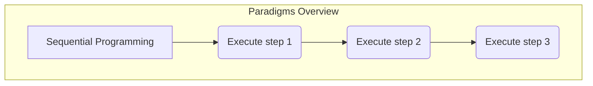
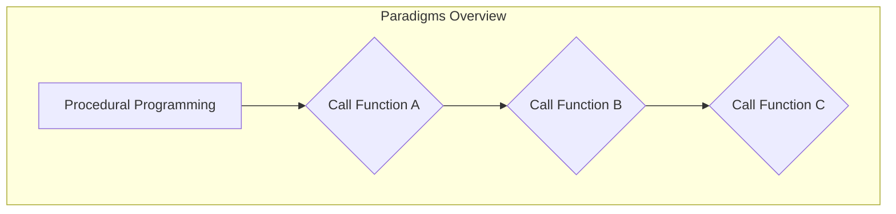
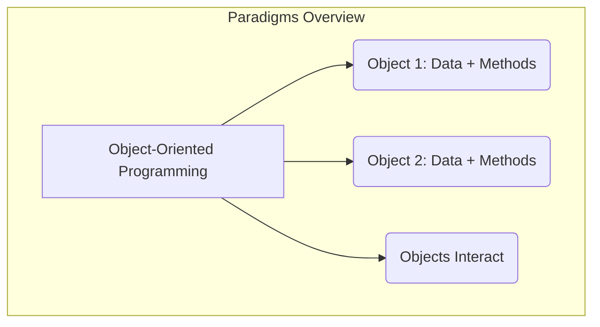
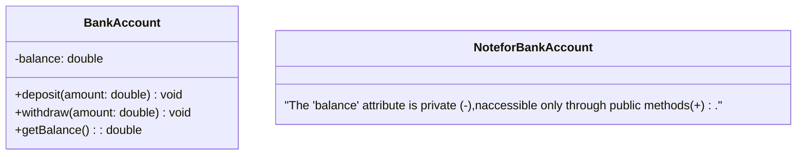
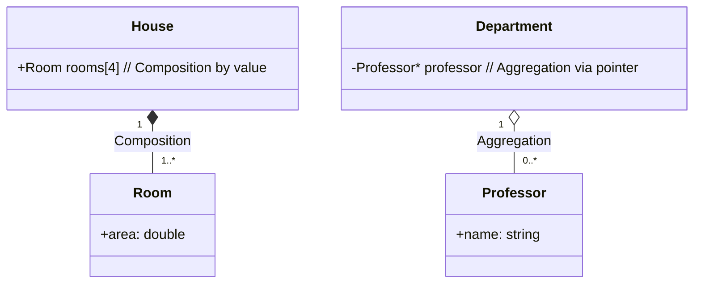
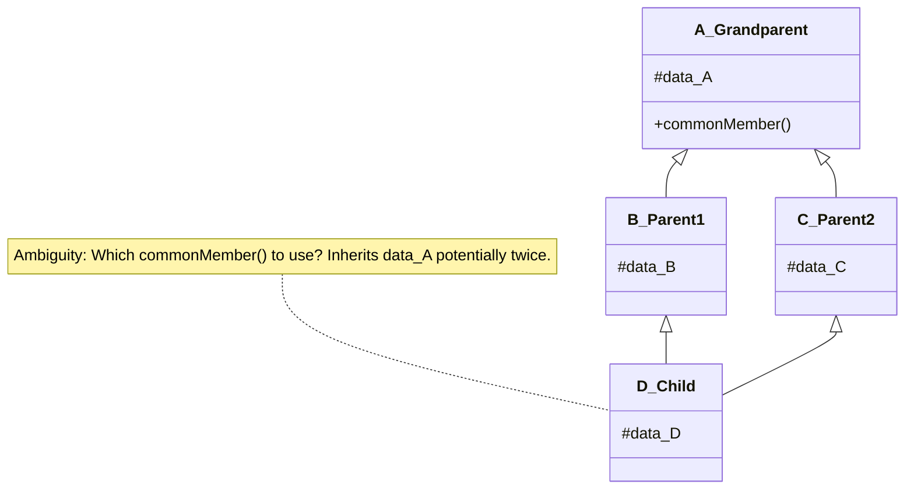
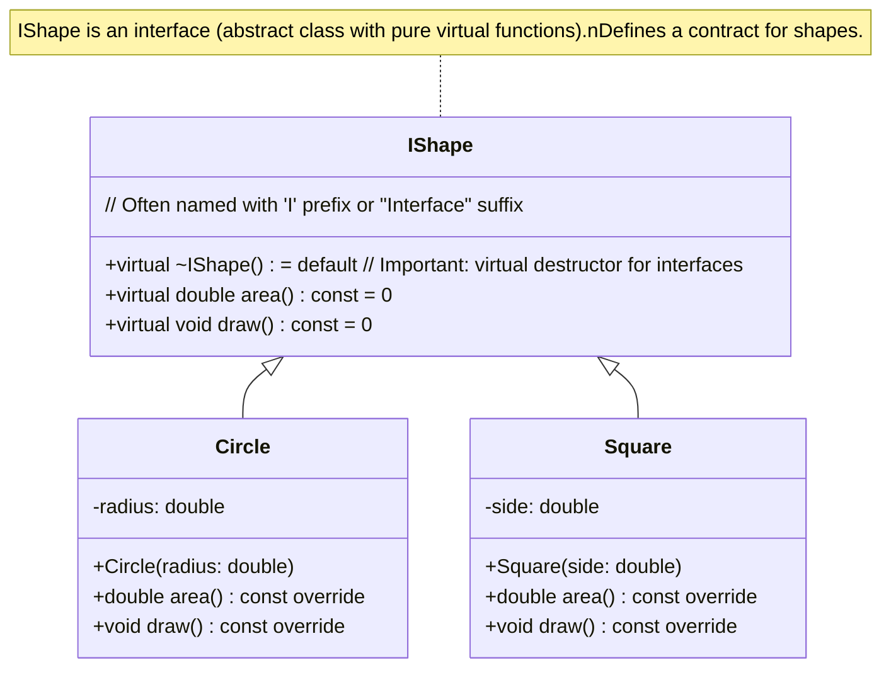

# OOP Notes

# Introduction to OOP

## Introduction to the Object-Oriented Paradigm

Object-Oriented Programming (OOP) is a programming model that:

- Organizes software design around <font color="#007ACC">"objects"</font> rather than "functions and logic".
- Emphasizes data and the behavior associated with that data.
- _Analogy_: 
  - Think of building with LEGOs (<font color="#007ACC">objects</font>) VS 
  - writing a detailed recipe (procedural). 
  - Each LEGO brick is an 
    - object with its own properties (color, shape) 
    - and potential functions (how it connects).

## Comparison with Sequential & Procedural Paradigms

Below is a comparison of programming paradigms:

| **Paradigm**              | **Description**                                                                                                                                               | **Example**                                                                                 |
| ------------------------- | ------------------------------------------------------------------------------------------------------------------------------------------------------------- | ------------------------------------------------------------------------------------------- |
| **Sequential**            | Code executes strictly line-by-line, following a single path of instructions.                                                                                 | A basic C++ script to print numbers 1 to 5 in order.                                        |
| **Procedural**            | Code is organized into functions or procedures that perform specific tasks. Control flow involves function calls.                                             | A C++ program with functions like `calculateArea()` and `displayResult()`.                  |
| **Object-Oriented (OOP)** | Code is organized around <font color="#007ACC">objects</font>, which bundle data (attributes) and methods (behavior). Focus is on modularity and reusability. | A `Car` object in C++ with data (`color`, `speed`) and methods (`accelerate()`, `brake()`). |






> [!Note]
> 
> - OOP shifts the focus from procedures to <font color="#008000">self-contained objects</font> that manage their own state and behavior.

## Data Abstraction

Data Abstraction is the concept of:

- Hiding <font color="#00b050">complex implementation details</font>.
- Showing only the ==essential features== of an object
- reduces programming complexity and effort.
- _Analogy_: 
	- Driving a car. 
	- You use the 
		- steering wheel, 
		- accelerator, and 
		- brake pedals (the <font color="#007ACC">public interface</font>) 
	- without needing to know the intricate workings of 
		- the engine or 
		- transmission (the <font color="#D2691E">private implementation</font>).
- _Example_: 
	- A `Database` class in C++ might have 
	- a `public connect()` method. 
	- Users of this class don't need to understand 
		- the low-level network protocols or 
		- handshake procedures involved in the connection process. 
	- They just call `connect()`.
    

## Encapsulation

Encapsulation involves:

- Bundling 
	- data (attributes) and the 
	- methods (functions) 
- that operate on that data within 
	- a single unit, called a <font color="#007ACC">class</font>.
- Restricting direct access to some of an object's components (achieved using access specifiers like <font color="#D2691E">private</font>). ==This is a protective barrier==.
- _Analogy_: 
	- A medicine capsule. 
	- The outer layer (the class <font color="#007ACC">interface</font>) protects the 
	- contents (data and implementation) 
	- from unintended external interference.
- _Example_: 
	- A `BankAccount` class in C++ 
	- encapsulates the `balance` attribute (making it `private`) and 
	- provides `public` methods like `deposit()` and `withdraw()`. 
	- This prevents direct, uncontrolled modification of the `balance`.




## Objects in the Real World

Objects in OOP are modeled after real-world entities. They have:

- **State**: Represented by <font color="#00b050">attributes</font> or <font color="#00b050">data members</font> (e.g., a car's color, a dog's breed).
- **Behavior**: Represented by <font color="#00b050">methods</font> or <font color="#00b050">member functions</font> (e.g., a car can `accelerate()`, a dog can `bark()`).
    - _Examples_:
        - A _dog_ has states (color, breed, age) and behaviors (bark, fetch, eat).
        - A _pen_ has states (ink color, type, ink level) and behaviors (write, retractNib).

## Classes and Objects

- **Class**:
    - A <font color="#00b050">blueprint</font> or template for creating objects.
    - Defines a set of properties (attributes) and methods that all objects of that class will have.
    - ==It's a logical construct==.
        - _Analogy_: A cookie cutter. The cutter defines the shape and design of a cookie.
- **Object**:
    - An <font color="#00b050">instance</font> of a class.
    - A concrete entity created from the class blueprint, residing in memory.
    - ==It's a physical entity (in terms of memory)==.
        - _Analogy_: A cookie made using the cookie cutter. Many cookies (<font color="#007ACC">objects</font>) can be made from one cutter (<font color="#007ACC">class</font>).

## Access Control (Access Specifiers)

In C++, access control mechanisms define the visibility of class members.


|**Specifier**|**Visibility**|**Purpose**|
|---|---|---|
|<font color="#D2691E">`public`</font>|Members are accessible from <font color="#008000">anywhere</font> (both inside and outside the class).|Defines the object's <font color="#007ACC">interface</font>.|
|<font color="#D2691E">`private`</font>|Members are accessible ==only within the class== itself.|Hides internal implementation details, crucial for <font color="#007ACC">encapsulation</font>.|
|<font color="#D2691E">`protected`</font>|Members are accessible within the class and by <font color="#00b050">derived classes</font> (subclasses).|Allows controlled access for <font color="#007ACC">inheritance hierarchies</font>.|

> [!Warning]
> 
> - Overuse of `public` members can break encapsulation and make code harder to maintain.

## Constructors and Destructors

### Constructors

is a <font color="#D2691E">special member function</font> that is:
- Automatically called when an object of a class is created (instantiated).
- Used primarily for ==initializing the object's data members==.
- Typically has the <font color="#007ACC">same name as the class</font> itself.
- <font color="#FF0000">Does not have a return type</font> (not even `void`).
- _Analogy_: 
  - **An orientation process** for a new employee when they join a company, 
  - setting them up with necessary resources and information.

**Types of Constructors (in ):**

- **Default**:
  - A constructor that can be called with ==no arguments==.
  - This means it either takes no parameters, or all its parameters have default values.
  - If no constructor is defined by the user, the compiler often provides a public default constructor (trivial constructor).
- **Parameterized**:
  - <font color="#00b050">accepts arguments</font>.
  - used to initialize the object's attributes with specific values at the time of creation.

- **Copy**:
  - A constructor that creates an object by ==initializing it with another object of the same class==.
  - It takes a reference to an object of the same class as an argument (typically `const ClassName&`).
  - Crucial for handling objects passed by value or returned by value, and for explicit object copying.

### Destructor

Also a <font color="#D2691E">special member function</font> that is:

- Automatically called when an object is about to be **destroyed** (e.g., goes out of scope, or `delete` is called on a pointer to the object).
- Used for ==releasing resources== that the object may have acquired during its lifetime (e.g., freeing dynamically allocated memory, closing files or network connections).
- Has the <font color="#007ACC">same name as the class, preceded by a tilde (`~`)</font>.
- <font color="#FF0000">Does not take any arguments and has no return type</font>.
- _Analogy_: 
  - An exit interview or a cleanup process 
  - when an employee leaves a company, 
  - ensuring all company assets are returned and accounts are settled.

## Setters and Getters (Mutators and Accessors)

These are public methods used to control access to an object's `private` data members, upholding encapsulation.

### Setters (Mutators)
- Public methods used to <font color="#FFA500">modify</font> the values of `private` attributes.
- Often include validation logic to ensure data integrity.
- _Example_: `void setName(const string& newName);`

### Getters (Accessors)
- Public methods used to <font color="#008000">retrieve</font> the values of `private` attributes.
- Provide read-only access to data. Often declared `const`.
- _Example_: `string getName() const;`

```cpp

class A{
    int member1;
    void setMember1(int s){
        setMember1 = s;
    }
    int getMember1(){
        return member1;
    }
};

```


## Member Initialization List 

- An alternative way 
  - to initialize member variables in a C++ constructor.
- The initialization is done ==before the constructor body is executed==.
- It's often more <font color="#008000">efficient</font>, especially for object members, `const` members, or reference members (which _must_ be initialized in the list).
- _Syntax Example_: 
 - `MyClass::MyClass(int a, string b) : memberA(a), memberB(b) { /* constructor body */ }`

```cpp
class A{
	int member1;
	float member2;
	A(int a, float b): member1(a), member2(b) {} // member init list
	
	A(int a, float b) {
		this->member1 = a;
		this->member2 = b;
	}
};

```

## Constants, Pointers to Constants, and Constant Functions 

### Constants (`const`):
- Variables whose values <font color="#FF0000">cannot be changed</font> after initialization.
- _Example_: `const double PI = 3.14159;`

### Constants with Pointers: 
 This involves combinations of `const` with pointers:
- `const int* ptr;` or `int const* ptr;`
  - Pointer to a constant integer.
  - ==The value pointed to cannot be changed== via this pointer, but the pointer itself can point to another address.
- `int* const ptr = &some_int;` (must be initialized)
  - Constant pointer to an integer.
  - The pointer address ==cannot be changed==, but the value at that address can be modified.
- `const int* const ptr = &some_const_int;` (must be initialized)
  - Constant pointer to a constant integer.

> [!Warning]
> 
> - Neither the pointer address nor the value it points to can be changed</font>

- **Constant Member Functions (`const` functions)**:
  - Class methods that **promise** ==not to modify any data members== of the object they are called on (unless the member is declared `mutable`).
  - Declared by placing the `const` keyword after the function's parameter list.
  - Can be called on `const` objects.
  - _Example_: `int getValue() const;`
  - USED IN GETTERS

```cpp

class A{

    int getValue() const{
        ...
    }

};

```

## Static Data Members and Static Member Functions 

### **Static Data Members**:
- Class members that are 
  - ==shared by all objects (instances) of the class==.
- Only one copy of the static data member exists.
- Must be <font color="#D2691E">defined outside the class</font> (usually in the .cpp file).
- _Analogy_: 
  - A shared whiteboard for all team members (objects).
  - Population of a type of object
- _Example_: 

```cpp
// In MyClass.h
static int objectCount;
// In MyClass.cpp
int MyClass::objectCount = 0;
```
### **Static Member Functions**:
- Class methods that can be called using the class name directly (e.g., `ClassName::staticMethod()`), ==without needing an object instance==.
- Can only access static data members and other static member functions of the class.
- <font color="#00b050">They do not have a `this` pointer</font>.
  - _Analogy_: A general announcement system not tied to a specific individual.
  - _Example_: `static int getObjectCount();`

## Inline Functions 

- A suggestion to the compiler 
  - (using the <font color="#D2691E">`inline`</font> keyword) to 
  - ==replace the function call with the actual code of the function== at compile time.
- Intended for 
  - small, 
  - frequently used functions 
  - to potentially reduce function call overhead.
- The compiler may choose to **ignore** the `inline` request. Often defined in header files.
- _Analogy_: 
  - A small note directly in the text instead of a footnote reference.

> [!warning] 
> 
> - Overuse of inlining for larger functions can lead to code bloat.

## `this` Pointer 

- A special pointer that is ==implicitly available within non-static member functions== of a class.
- It holds the <font color="#00b050">address of the current object</font> for which the member function is being called.
- Used to:
  - Distinguish between member variables and parameters with the same name (e.g., `this->member = member;`).
  - Return a reference or pointer to the current object (e.g., for method chaining: `return *this;`).
  - _Analogy_: Saying "me" or "myself" to refer to oneself.

## Array of Objects 

- A collection of objects of the <font color="#00b050">same class</font> stored contiguously.
    - _Example_: `Student studentList[30];` // Calls default constructor for 30 Student objects.
    - Members are accessed using `studentList[i].memberName`.
    - If using pointers: `Student* studentPtrArray[30];` // Array of pointers, objects must be allocated separately.

---

# Core OOP Concepts I (Composition, Inheritance, Polymorphism)

## "Has-A" Relation (Composition & Aggregation)

This represents a relationship where one class instance "has an" instance of another class as a member. It signifies a <font color="#007ACC">part-whole relationship</font>.

- **Composition (Strong "has-a" / "is-part-of")**:
    - Represents strong ownership. The ==contained object's lifecycle is dependent on the container object==.
    - If the container is destroyed, the contained object (member) is also destroyed.
        - _Analogy_: A `House` _has-a_ `Room`. If the `House` is demolished, its `Rooms` cease to exist. In C++, often implemented by having the member object directly as a data member.
- **Aggregation (Weak "has-a")**:
    - Represents a weaker relationship. The contained object can ==exist independently of the container object's lifecycle==.
    - The container "has" a pointer or reference to an external object.
        - _Analogy_: A `Department` _has-a_ `Professor`. If the `Department` closes, the `Professor` can still exist. In C++, often implemented using pointers or references to objects managed elsewhere.




## Introduction to Inheritance 

Inheritance allows a new class (<font color="#00b050">derived class</font>) to acquire properties and methods from an existing class (<font color="#00b050">base class</font>).

- Promotes ==code reuse==.
- Establishes an <font color="#007ACC">"is-a" relationship</font> (e.g., a `Dog` _is an_ `Animal`).
    - _Analogy_: Inheriting traits from parents.
    - _Benefit_: Reduces redundancy, improves organization.

> **Key Concept:** Inheritance models a hierarchy, from general (base) to specific (derived).

## Types of Inheritance 

- **Single Inheritance**: A derived class inherits from ==only one base class==.
    
    
    
    ``` mermaid
    classDiagram
        class BaseClass {
            +baseMethod()
        }
        class DerivedClass {
            +derivedMethod()
        }
        BaseClass <|-- DerivedClass
    ```
    
### **Multiple** 
- A derived class inherits from ==more than one base class==.
    - <font color="#FFA500">Can lead to complexities</font> like the Diamond Problem.
    
    
    
    
    
    ```mermaid
    classDiagram
        class BaseClassA {
            +methodA()
        }
        class BaseClassB {
            +methodB()
        }
        class DerivedClass {
            +derivedMethod()
        }
        BaseClassA <|-- DerivedClass
        BaseClassB <|-- DerivedClass
    ```
    
### **Multilevel**
- A class inherits from a derived class, forming a <font color="#00b050">chain</font>.

    ```mermaid
    classDiagram
        class Grandparent {
            +grandparentMethod()
        }
        class Parent {
            +parentMethod()
        }
        class Child {
            +childMethod()
        }
        Grandparent <|-- Parent
        Parent <|-- Child
    ```
    
### **Hierarchical** 
- ==Multiple derived classes inherit from a single base class==.


    ```mermaid
    classDiagram
        class Shape {
            +draw()
        }
        class Circle {
            +drawCircle()
        }
        class Square {
            +drawSquare()
        }
        Shape <|-- Circle
        Shape <|-- Square
    ```


###  **Hybrid** 

- A <font color="#00b050">combination of two or more types</font> of inheritance.
   

## Data and Code Hiding (Reiteration of Encapsulation)

Achieved through <font color="#007ACC">encapsulation</font> by:

- Using access specifiers (`private`, `protected`).
- Exposing a well-defined `public` interface.
  - _Benefit_: Protects data, simplifies interface, allows internal changes ==without affecting client code==.

## Polymorphism in OOP 

Polymorphism ("many forms") allows:

- Objects of different classes to be treated via a common base class interface.
- Objects to respond to the <font color="#00b050">same method call in different ways</font>.
  - _Analogy_: "Open" can mean open a _door_, a _bottle_, or a _file_.

## Function Overriding and Overloading 

### **Function Overriding (Runtime Polymorphism)**:
    
- A <font color="#00b050">derived class provides a specific implementation for a virtual method</font> that is already defined in its base class.
- Method signatures must be compatible (often identical, or with covariant return types for pointers/references).
- Decision made at <font color="#FFA500">runtime</font>. Uses the <font color="#D2691E">`virtual`</font> keyword in the base class, and optionally <font color="#D2691E">`override`</font> in the derived class for safety.
	- _Example_: `Animal` base class has `virtual void makeSound()`. `Dog` derived class: `void makeSound() override`.

#### code example

```cpp
#include <iostream>

class Calculator {
public:
    int add(int a, int b) {
        cout << "Adding two integers: ";
        return a + b;
    }

    double add(double a, double b) {
        cout << "Adding two doubles: ";
        return a + b;
    }

    double add(int a, double b) {
        cout << "Adding an integer and a double: ";
        return a + b;
    }

    double add(double a, int b) {
        cout << "Adding a double and an integer: ";
        return a + b;
    }
};

int main() {
    Calculator calc;
    cout << calc.add(5, 3) << endl;       // Calls add(int, int)
    cout << calc.add(2.5, 7.8) << endl;   // Calls add(double, double)
    cout << calc.add(10, 3.14) << endl;  // Calls add(int, double)
    cout << calc.add(6.28, 2) << endl;   // Calls add(double, int)
    return 0;
}
```

###  **Function Overloading (Compile-time Polymorphism)**:

- <font color="#00b050">Multiple functions in the same scope have the same name but different parameter lists</font> (number, type, or order of parameters).
- Compiler decides at <font color="#FFA500">compile-time</font>.
- <font color="#FF0000">Return type alone is NOT sufficient</font> to overload.
	- _Example_: `int add(int a, int b);` and `double add(double a, double b);`


#### code example

```cpp
#include <iostream>

class Animal {
public:
    virtual void makeSound() {
        cout << "Generic animal sound" << endl;
    }
};

class Dog : public Animal {
public:
    void makeSound() override {
        cout << "Woof!" << endl;
    }
};

class Cat : public Animal {
public:
    void makeSound() override {
        cout << "Meow!" << endl;
    }
};

int main() {
    Animal* animalPtr;
    Animal genericAnimal;
    Dog myDog;
    Cat myCat;

    animalPtr = &genericAnimal;
    animalPtr->makeSound(); // Calls Animal::makeSound()

    animalPtr = &myDog;
    animalPtr->makeSound();   // Calls Dog::makeSound() (due to virtual function)

    animalPtr = &myCat;
    animalPtr->makeSound();   // Calls Cat::makeSound() (due to virtual function)

    return 0;
}
```

**Comparison: Overriding vs. Overloading**

| Feature      | Function Overriding                 | Function Overloading                    |
| :----------- | :---------------------------------- | :-------------------------------------- |
| Purpose      | Specific implementation in subclass | Same name, different args in same scope |
| Scope        | Base and derived classes            | Same class/scope                        |
| Signature    | Compatible (name, params)           | Different parameters                    |
| Polymorphism | Runtime                             | Compile-time                            |
| Mechanism    | virtual functions, override         | Function signature matching             |


## Friend Function 

- A <font color="#00b050">non-member function</font> granted special access to `private` and `protected` members of a class.
- Declared within the class using the <font color="#D2691E">`friend`</font> keyword.
- ==Use sparingly== as it can weaken encapsulation.
    - _Analogy_: A trusted external auditor.

## Operator Overloading 

- Allows user-defined types (classes) to use standard operators (e.g., `+`, `-`, `<<`) naturally.
- Implemented as member functions or <font color="#D2691E">`friend`</font> functions.
- <font color="#00b050">Enhances code readability</font>.
    - _Example_: Overloading `+` for `ComplexNumber`: `Complex c3 = c1 + c2;`.

## Multiple Inheritance & Its Issues (The Diamond Problem) 

- **Multiple Inheritance**: A class inherits from multiple base classes.
- **The Diamond Problem**:
    - Ambiguity when a class D inherits from B and C, and B and C both inherit from a common base A.
    - If A has `commonMember()`, ==D gets it via both B and C, causing ambiguity==.




## Virtual Inheritance 

- Solves the Diamond Problem by ensuring ==only one copy of the common base class's members== is inherited.
- The common base class is inherited using <font color="#D2691E">`virtual`</font> keyword.
    - _Syntax_: `class B_Parent1 : virtual public A_Grandparent { ... };`
    - `class C_Parent2 : virtual public A_Grandparent { ... };`

## Virtual Functions 

- Base class member functions declared with <font color="#D2691E">`virtual`</font>.
- Enables <font color="#007ACC">runtime polymorphism</font>.
- When called via a base class pointer/reference to a derived object, the ==derived class's overridden version is executed==.
    - _Example_: `Animal* ptr = new Dog(); ptr->makeSound();` // Calls Dog's `makeSound` if it's virtual.
    - Use <font color="#D2691E">`override`</font> specifier in derived classes for safety (C++11 and later).

> [!Note] 
> For Pure Virtual Functions & Abstract Classes 
> 
> A virtual function assigned = 0 is a <font color="#D2691E">pure virtual function</font> (e.g., virtual void draw() = 0;). A class with one or more pure virtual functions becomes an <font color="#007ACC">abstract class</font>.

---

# Core OOP Concepts II (Advanced Topics - )

## Abstract Classes & Interfaces 

### **Abstract Class**
    
- A class that ==cannot be instantiated== 
- Designed as a base class
- Contains at least one <font color="#D2691E">pure virtual function</font> 
  - (e.g., `virtual void func() = 0;`).
- Derived concrete classes _must_ implement all inherited pure virtual functions.
  - _Analogy_: "Vehicle" is abstract; `Car`, `Bike` are concrete.
  - _Purpose_: Define a common <font color="#007ACC">interface</font> and enforce a contract.

### **Interface (in )**:
    
- Typically an <font color="#00b050">abstract class</font> containing ==exclusively pure virtual functions== 
  - (and possibly static constants or typedefs).
- Defines a strict contract without any implementation.
  - _Analogy_: A remote control blueprint specifying buttons, not internal workings.




## Introduction to Filing (File I/O in )

File I/O allows programs to <font color="#008000">persist data</font>. C++ uses streams from `<fstream>`.

Key Concepts:

### **Streams (`ifstream`, `ofstream`, `fstream`)**:
- `ifstream`: Input file stream (for reading).
- `ofstream`: Output file stream (for writing).
- `fstream`: File stream for both reading and writing.

### **Types of Files**:
- **Text Files**: Data as human-readable characters. Handled with default stream behavior.
- **Binary Files**: Data as raw bytes. Opened with `ios::binary` mode. ==More efficient for non-textual data==.

## Filing Continue (File Operations in )

### 1. **Opening a File**:
- `ofstream outFile("example.txt");` or `ifstream inFile; inFile.open("data.bin", ios::binary);`
- Modes: `ios::in`, `ios::out`, `ios::app` (append), `ios::binary`, `ios::trunc` (truncate). Can be combined with `|`.
### 2. **Checking if Open**: 
- `if (outFile.is_open()) { ... }` or `if (!inFile) { /* error */ }`.
### 3. **Reading/Writing**:
- Using `<<` (insertion) and `>>` (extraction) operators for formatted I/O.
- Methods like `getline()`, `read()`, `write()`.
### 4. **Closing a File**:
- Files are ==closed automatically when stream objects go out of scope== (RAII principle).
- Explicit close: `outFile.close();`. <font color="#FF0000">Essential if reusing the stream object for another file</font>.
### 5. **Error Handling**: Check stream state (e.g., `inFile.good()`, `inFile.fail()`, `inFile.eof()`).

## File manipulation

- functions that manipulate and deal with the cursor

> *file handling in C++ (and many other languages) comes with special features beyond just reading and writing data sequentially. These features allow you to navigate within a file, check its status, and perform more sophisticated operations. Let's explore some of these, focusing on cursor manipulation and status checks like EOF.*

### Cursor (File Pointer) Manipulation

The "cursor" or "file pointer" indicates the current position within the file where the next read or write operation will occur.

#### **1. `seekg()` (for input streams - `ifstream`, `fstream`)**

  * **Purpose:** Sets the position of the get pointer (the reading cursor) in an input stream.
  * **Behaviors:**
      * Takes an offset and a direction as arguments (or just an absolute position).
      * Directions include:
          * `ios::beg`: Beginning of the stream.
          * `ios::cur`: Current position in the stream.
          * `ios::end`: End of the stream.

##### **Read Mode Example:**

```cpp
#include <iostream>
#include <fstream>

using namespace std;

int main() {
    ifstream iFile("example.txt");
    if (!iFile.is_open()) 
        return 1;
    
    char ch;

    // Read the 5th character (0-based index)
    iFile.seekg(4, ios::beg);
    iFile.get(ch);
    cout << "5th character: " << ch << endl;

    // Move back 2 characters from the current position
    iFile.seekg(-2, ios::cur);
    iFile.get(ch);
    cout << "Character 2 positions back: " << ch << endl;

    // Move to 3 characters before the end
    iFile.seekg(-3, ios::end);
    iFile.get(ch);
    cout << "3rd character from the end: " << ch << endl;

    iFile.close();
    return 0;
}
```
 
##### **`seekg()` Behavior in Write Mode (for `fstream` opened for both read and write):**

When an `fstream` is opened with modes like `ios::in | ios::out`, `seekg()` will still move the get pointer, affecting subsequent read operations. However, it doesn't directly influence where the *next write* will occur if you haven't performed a read operation in between. The write pointer has its own position.

#### **2. `seekp()` (for output streams - `ofstream`, `fstream`)**

  * **Purpose:** Sets the position of the put pointer (the writing cursor) in an output stream.
  * **Behaviors:** Similar to `seekg()`, it takes an offset and a direction.

##### **Write Mode Example:**

```cpp
#include <iostream>
#include <fstream>

using namespace std;

int main() {
    fstream oFile("example_write.txt", ios::out | ios::binary); // Binary for precise byte positioning
    if (!oFile.is_open()) 
        return 1;
    

    const char dataToWrite[] = "Hello World!";
    oFile.write(dataToWrite, sizeof(dataToWrite) - 1); // Write initial data

    // Move to the beginning and overwrite the first 5 characters
    oFile.seekp(0, ios::beg);
    const char overwriteData[] = "Hi!!!";
    oFile.write(overwriteData, sizeof(overwriteData) - 1);

    // Move to the end and append
    oFile.seekp(0, ios::end);
    const char appendData[] = " Appended.";
    oFile.write(appendData, sizeof(appendData) - 1);

    oFile.close();
    return 0;
}
```

##### **`seekp()` Behavior in Read Mode (for `fstream` opened for both read and write):**

> - When an `fstream` is 
>   - opened for both reading and writing, 
>   - `seekp()` moves the **put pointer**, affecting subsequent write operations. 
> - If you then perform a read, 
>   - the read will start from the current position of the **get pointer**
>       - (which might be different if you've only used `seekp()` since the last read).

#### **3. `tellg()` (for input streams)**

  * **Purpose:** Returns the current position of the get pointer in an input stream.

##### **Read Mode Example:**

```cpp
#include <iostream>
#include <fstream>

using namespace std;

int main() {
    ifstream iFile("example.txt");
    if (!iFile.is_open()) 
        return 1;

    char ch;
    // Read the next character from the input file stream 'iFile' and store it in 'ch'.
    iFile.get(ch);
    cout << "Read character: " << ch << ", Position: " << iFile.tellg() << endl;

    // move the get pointer 5 bytes from beginning
    iFile.seekg(5, ios::beg);
    cout << "Moved to position: " << iFile.tellg() << endl;

    iFile.close();
    return 0;
}
```

##### **`tellg()` Behavior in Write Mode (for `fstream`):**

In an `fstream` opened for both read and write, `tellg()` returns the current position of the get pointer, which might be independent of the put pointer's position if only write operations have occurred since the last read or seek on the input side.

#### **4. `tellp()` (for output streams)**

  * **Purpose:** Returns the current position of the put pointer in an output stream.

**Write Mode Example:**

```cpp
#include <iostream>
#include <fstream>

int main() {
    ofstream oFile("example_write.txt");
    if (!oFile.is_open()) {
        cerr << "Error opening file for writing." << endl;
        return 1;
    }

    oFile << "Hello";
    cout << "Wrote 'Hello', Position: " << oFile.tellp() << endl;

    oFile << " World!";
    cout << "Wrote ' World!', Position: " << oFile.tellp() << endl;

    oFile.close();
    return 0;
}
```

#### **`tellp()` Behavior in Read Mode (for `fstream`):**

> - when `fstream` opened for both **reading** and **writing**, 
>   - `tellp()` returns the **current position of the put pointer**. 
> - *This is useful for tracking where the next write operation will occur.*

### File Status Checks

These functions allow you to check the current state of the file stream.

#### **1. `eof()` (End-Of-File)**

  * **Purpose:** Returns `true` if 
    * the end-of-file indicator for the stream is set. 
    * This usually happens after an attempt to read past the end of the file.
  * **Behavior in Read Mode:** Commonly used in loops 
    * to determine when all data has been read. 

>[!Warning]
>  
> - `eof()` becomes `true` *after* a read operation fails because it tried to read past the end. It's generally better to check the result of the read operation itself.

##### **Read Mode Example (Correct Usage):**

```cpp
#include <iostream>
#include <fstream>
#include <string>

using namespace std;

int main() {
    ifstream iFile("example.txt");
    if (!iFile.is_open()) 
        return 1;
    

    string line;
    
    // Read returns false at EOF
    while (getline(iFile, line)) { 
        cout << line << endl;
    }

    if (iFile.eof()) {
        cout << "Reached end of file." << endl;
    } else if (iFile.fail()) {
        cerr << "Error during reading." << endl;
    }

    iFile.close();
    return 0;
}
```

  > ***Behavior in Write Mode:** `eof()` is generally not meaningful for output streams because you are writing to the file, and there isn't a natural "end" in the same way as when reading. It will typically return `false` unless the stream has encountered a critical error.

#### **2. `fail()`**

  * **Purpose:** Returns `true` if 
    * an error occurred on the last stream operation (either input or output). 
    * This could be due to a format error, a read/write error, or reaching EOF.
  * **Behavior in Both Read and Write Modes:** Indicates that a previous operation failed. 
    * You should check this after any file operation to ensure it was successful.

##### **Example (Both Modes):**

```cpp
#include <iostream>
#include <fstream>

using namespace std;

int main() {
    // Read mode
    ifstream iFile("non_existent_file.txt");
    if (iFile.fail()) {
        cerr << "Failed to open input file or a read error occurred." << endl;
    }
    iFile.close();

    // Write mode (attempting an invalid operation)
    ofstream oFile("example_write.txt");
    if (oFile.is_open()) {
        // Simulate an error (this is OS dependent and might not always trigger fail immediately)
        oFile.setstate(ios::failbit);
        oFile << "Trying to write after error.";
        if (oFile.fail()) {
            cerr << "Write operation failed." << endl;
        }
        oFile.close();
    }

    return 0;
}
```

#### **3. `bad()`**

  * **Purpose:** Returns `true` if 
    * a severe error has occurred on the stream, 
    * usually indicating a loss of integrity of the stream buffer (e.g., a serious hardware error). 
    * If `bad()` is true, the stream is generally unusable.
  * **Behavior in Both Read and Write Modes:** Indicates a critical failure of the stream.

**Example (Simulating a bad state - OS dependent):**

```cpp
#include <iostream>
#include <fstream>

using namespace std;

int main() {
    ofstream oFile("example_write.txt");
    
    if (oFile.is_open()) {
        oFile.setstate(ios::badbit); // Force a bad state
        
        oFile << "Trying to write after bad state.";
        if (oFile.bad()) {
            cerr << "Stream is in a bad state." << endl;
        }
        
        oFile.close();
    }
    return 0;
}
```

#### **4. `good()`**

  * **Purpose:** Returns `true` 
    * if none of the error flags (`eofbit`, `failbit`, `badbit`) are set. 
    * This means the last operation was successful, and the stream is in a good state for the next operation.
  * **Behavior in Both Read and Write Modes:** Indicates that the stream is currently operational.

##### **Example:**

```cpp
#include <iostream>
#include <fstream>
#include <string>

using namespace std;

int main() {
    ifstream iFile("example.txt");
    
    if (iFile.is_open()) {
        string line;
        getline(iFile, line);
        if (iFile.good()) {
            cout << "Successfully read a line." << endl;
        } else {
            cerr << "Error occurred during or after reading." << endl;
        }
        iFile.close();
    } else {
        cerr << "Error opening file." << endl;
    }
    return 0;
}
```


## Filing examples


### Reading from a Text File (Character by Character)

```cpp
#include <iostream>
#include <fstream>

using namespace std;

int main() {
    
    ifstream iFile("my_text_file.txt");
    
    if (!iFile.is_open()) 
        return 1;
    
    char ch;
    while (iFile.get(ch)) {
        cout << ch;
    }
    
    iFile.close();
    
    return 0;
}
```

### Reading from a Text File (Line by Line)

```cpp
#include <iostream>
#include <fstream>
#include <string>

using namespace std;

int main() {
    ifstream iFile("my_text_file.txt");
    if (!iFile.is_open()) 
        return 1;
    
    string line;
    
    while (getline(iFile, line)) {
        cout << line << endl;
    }
    
    iFile.close();
    
    return 0;
}
```

### Writing to a Text File

```cpp
#include <iostream>
#include <fstream>
#include <string>

int main() {
    ofstream oFile("my_output_file.txt");
    if (!oFile.is_open()) {
        cerr << "Error opening file!" << endl;
        return 1;
    }
    oFile << "Hello, this is some text.n";
    oFile << "Writing another line to the file.n";
    oFile.close();
    return 0;
}
```

### Writing to a Binary File (Integer)

```cpp
#include <iostream>
#include <fstream>

using namespace std;

int main() {
    ofstream oFile("my_binary_file.dat", ios::binary);
    
    if (!oFile.is_open()) 
        return 1;
    
    int number = 12345;
    
    oFile.write(reinterpret_cast<const char*>(&number), sizeof(number));
    
    oFile.close();
    
    return 0;
}
```

### Reading from a Binary File (Integer)

```cpp
#include <iostream>
#include <fstream>

using namespace std;

int main() {
    ifstream iFile("my_binary_file.dat", ios::binary);
    
    if (!iFile.is_open()) 
        return 1;

    int number;

    iFile.read(reinterpret_cast<char*>(&number), sizeof(number));
    
    cout << "Read number: " << number << endl;
    
    iFile.close();
    
    return 0;
}
```

### Writing an Object to a Binary File

```cpp
#include <iostream>
#include <fstream>
#include <string>

using namespace std;

class Data {
public:
    int id;
    string name;
};

int main() {
    Data myData = {1, "Example"};
    
    ofstream oFile("my_object_file.dat", ios::binary);
    if (!oFile.is_open()) 
        return 1;
    
    oFile.write(reinterpret_cast<const char*>(&myData), sizeof(myData));
    oFile.close();
    return 0;
}
```

### Reading an Object from a Binary File

```cpp
#include <iostream>
#include <fstream>
#include <string>

using namespace std;

class Data {
public:
    int id;
    string name;
};

int main() {
    Data readData;
    
    ifstream iFile("my_object_file.dat", ios::binary);
    if (!iFile.is_open()) 
        return 1;
    
    iFile.read(reinterpret_cast<char*>(&readData), sizeof(readData));
    
    cout << "Read Data - ID: " << readData.id << ", Name: " << readData.name << endl;
    
    iFile.close();
    
    return 0;
}
```

## Generics (Templates in )

Templates allow writing code that works with <font color="#00b050">different data types</font> without rewriting.

- Promotes ==code reusability== and <font color="#008000">type safety</font>.

## Generics and Templates  Details

- **Function Templates**: Blueprints for functions.
    - _Example_: `template <typename T> T maxVal(T a, T b) { return (a > b) ? a : b; }`
- **Class Templates**: Blueprints for classes.
    - _Example_: `template <class T> class MyList { T* data; /* ... */ }; MyList<int> intList;`
- ==Template instantiation occurs at compile time==.


## Introduction to Exception Handling

- is a <font color="#007ACC">structured mechanism</font> in C++ 
- designed to detect and respond to **runtime errors** 
  - (also known as exceptions) 
  - anomalous or exceptional conditions that a program encounters during its execution. 
- These are errors that cannot typically be caught at compile time, such as :
  - trying to open a non-existent file, 
  - attempting to divide by zero, or 
  - requesting memory when none is available.

The "structured" aspect means C++ provides a formal, well-defined way to:

1.  **Signal** that an error has occurred (using `throw`).
2.  **Detect** errors in a specific region of code (using `try`).
3.  **Handle** these errors in a designated block of code (using `catch`).

> [!note]
> - A key benefit is that it 
> - **separates error-handling code from the normal program logic**. 
> - *In traditional error handling using return codes, the main flow of a function can become cluttered with `if-else` statements checking for errors after almost every operation. Exception handling allows the "happy path" (normal execution) to be written more cleanly within a `try` block, with the error management code consolidated in separate `catch` blocks. This improves code readability, maintainability, and robustness, allowing for more graceful error recovery or controlled program termination.*

### Key C++ Components:

####  * **`try` block**:

  * section of code that is "guarded." 
    * You place code within a `try { ... }` block if you anticipate that an exception might be thrown, 
      * either directly by the code within the `try` block itself or 
      * by a function called from within the `try` block 
      * (or any function in that call chain).
  * If an exception is thrown inside the `try` block, 
    * the normal sequence of execution within that block is **immediately stopped.** 
    * The program then starts looking for a `catch` block that 
      * can handle the type of exception that was thrown.
  * If no exceptions, 
    * occur within the `try` block, all associated `catch` blocks are **simply ignored**, and execution continues after the last `catch` block.

  #### **`catch` block(s)**:

  *  code to handle an exception. 
  *  must immediately follow a 
	  * `try` block or 
	  * another `catch` block. 
  * The syntax is `catch (ExceptionType variableName) { /* handler code */ }`.
  * When an exception is thrown, 
	  * the runtime system looks for a `catch` block whose `ExceptionType` matches the type of the thrown exception object.
  * **Matching:**
      * An exact type match.
      * A base class type in the `catch` block can 
	      * catch exceptions of its derived class types 
	      * (this is an important polymorphic aspect of exception handling).
  * **Order Matters:** 
	  * You can have multiple `catch` blocks for a single `try` block 
		  * to handle different types of exceptions. 
	  * They are checked in the order they appear. 
		  * The <font color="#FF0000">first `catch` block that matches the exception type is executed</font>. 
		  * For this reason, 
			  * if you're catching related exceptions from an inheritance hierarchy, 
			  * you should <font color="#FF0000">catch derived class exceptions before their base class exceptions</font>.


##### `catch (const exception& e)`:

* `exception` (defined in `<exception>`) is 
   * the base class for all standard exceptions thrown by the C++ library 
     * (e.g., 
        * `runtime_error`, 
        * `logic_error`, 
        * `bad_alloc`, 
        * `out_of_range`).
* Catching `const exception& e` is 
  * a common way to handle standard library exceptions polymorphically. 
  * The `const&` (constant reference) is important because:
    * It avoids "slicing" if a derived exception object is caught by a base class type.
    * It avoids the overhead of copying the exception object.
    * It allows you to call 
      * `const` member functions of the exception object, 
      * most notably `e.what()`, which typically returns a C-style string describing the error.

##### `catch (...)`:
*  will catch ***any exception***, 
   *  regardless of its type, 
   *  including C-style exceptions or non-standard C++ exceptions.
* Because it catches everything, it should <font color="#FF0000">always be the last `catch` block</font> in a sequence of handlers.
* It's often used for last-resort, 
  * *logging an unknown error, or*
  * *performing cleanup before re-throwing the exception (using `throw;`)*
  * *if the specific error type cannot be handled there.*

#### **`throw` statement**:

* used to signal that 
  * an exceptional condition has occurred. 
  * When a `throw` statement is executed, 
    * the current scope of execution is exited, 
    * runtime system begins searching for a suitable `catch` handler.
* You can `throw` an object of any type, but 
  * it's standard practice to throw objects of classes derived (directly or indirectly) from `exception`.
* Example: 
  * `throw runtime_error("Something went seriously wrong with the network connection!");`


* **Re-throwing an Exception:** 
  * Inside a `catch` block, you can re-throw the currently caught exception  
    * using a plain `throw;` statement (with no expression). 
    * allows a handler to perform some action (like logging the error) and then pass the same exception on to another handler further up the call stack.

* **Analogy**:

  * You `try` to cook a meal.
  * If a fire (`exception`) starts during your cooking process, you immediately stop cooking.
  * You then `catch` the fire with an extinguisher (the specific `catch` block for "fire" exceptions).
  * `finally` 
    * *(conceptually, though C++ doesn't have a direct `finally` keyword; this is often managed by destructors of local objects via RAII, or by careful coding, e.g., a catch-all that re-throws)* 
    * you ensure the kitchen is cleaned up or the fire department is called if you couldn't handle it completely.

### Code Examples :

#### 1. Standard Exception Handling (e.g., `out_of_range`)

demonstrates catching a standard C++ exception that occurs when trying to access a vector element outside its valid range using the `.at()` method.

```cpp
#include <iostream>
#include <vector>
#include <stdexcept> // For out_of_range

using namespace std;

int main() {
    vector<int> numbers = {10, 20, 30};

    try {
        // Attempt to access an element that is out of bounds.
        // The .at() method throws out_of_range if the index is invalid.
        cout << "Accessing numbers.at(1): " << numbers.at(1) << endl; // Valid
        cout << "Accessing numbers.at(5): " << numbers.at(5) << endl; // Invalid, will throw
        cout << "This line will not be printed if an exception occurs above." << endl;
    } catch (const out_of_range& e) {
        // Catch the specific out_of_range exception.
        cerr << "Error: An out_of_range exception occurred!" << endl;
        cerr << "Details: " << e.what() << endl;
    } catch (const exception& e) {
        // A more general catch block for other standard exceptions.
        cerr << "Error: A standard exception occurred!" << endl;
        cerr << "Details: " << e.what() << endl;
    }

    cout << "Program execution continues after the try-catch block." << endl;
    return 0;
}
```

**Expected Output for Example 1:**

```
Accessing numbers.at(1): 20
Error: An out_of_range exception occurred!
Details: vector::_M_range_check: __n (which is 5) >= this->size() (which is 3)
Program execution continues after the try-catch block.
```

#### 2. Custom Exception Class

This example shows how to define and use your own simple exception class, typically by inheriting from `exception` or one of its derivatives like `runtime_error`.

```cpp
#include <iostream>
#include <string>
#include <stdexcept> // For inheriting from runtime_error

using namespace std;

// Simple custom exception class
class MyCustomError : public runtime_error {
public:
    // Constructor takes an error message
    MyCustomError(const string& message)
        : runtime_error(message) {}
};

void performTask(int task_id) {
    cout << "Performing task: " << task_id << endl;
    if (task_id < 0) {
        // Throw an instance of our custom exception
        throw MyCustomError("Task ID cannot be negative.");
    } else if (task_id == 0) {
        throw invalid_argument("Task ID cannot be zero (standard exception example).");
    }
    cout << "Task " << task_id << " completed successfully." << endl;
}

int main() {
    try {
        performTask(100);
        performTask(-5); // This will throw MyCustomError
        performTask(200); // This line will not be reached
    } catch (const MyCustomError& e) {
        // Catch our specific custom error
        cerr << "Custom Error Caught: " << e.what() << endl;
    } catch (const invalid_argument& e) {
        // Catch a specific standard error
        cerr << "Invalid Argument Caught: " << e.what() << endl;
    } catch (const exception& e) {
        // Fallback for other standard exceptions
        cerr << "A standard exception was caught: " << e.what() << endl;
    }

    cout << "Trying task ID 0:" << endl;
    try {
        performTask(0); // This will throw invalid_argument
    } catch (const MyCustomError& e) {
        cerr << "Custom Error Caught: " << e.what() << endl;
    } catch (const invalid_argument& e) {
        cerr << "Invalid Argument Caught: " << e.what() << endl;
    }
    
    cout << "Program continues." << endl;
    return 0;
}
```

**Expected Output for Example 2:**

```
Performing task: 100
Task 100 completed successfully.
Performing task: -5
Custom Error Caught: Task ID cannot be negative.
Trying task ID 0:
Performing task: 0
Invalid Argument Caught: Task ID cannot be zero (standard exception example).
Program continues.
```

#### 3. Inherited Custom Exception Classes

This example demonstrates creating a hierarchy of custom exception classes and catching them appropriately, highlighting the importance of the order of `catch` blocks.

```cpp
#include <iostream>
#include <string>
#include <stdexcept>

using namespace std;

// Base custom error class
class DeviceError : public runtime_error {
public:
    DeviceError(const string& msg) : runtime_error("DeviceError: " + msg) {}
};

// Derived custom error class
class PrinterError : public DeviceError {
public:
    PrinterError(const string& printerName, const string& msg)
        : DeviceError("Printer '" + printerName + "' - " + msg), m_printerName(printerName) {}
    const string& getPrinterName() const { return m_printerName; }
private:
    string m_printerName;
};

// Another derived custom error class
class ScannerError : public DeviceError {
public:
    ScannerError(const string& scannerModel, const string& msg)
        : DeviceError("Scanner '" + scannerModel + "' - " + msg) {}
};

void operateDevice(const string& deviceType, const string& name) {
    cout << "Operating " << deviceType << ": " << name << endl;
    if (deviceType == "printer") {
        if (name == "Inkjet-01") {
            throw PrinterError(name, "Out of ink.");
        }
    } else if (deviceType == "scanner") {
        if (name == "Flatbed-X") {
            throw ScannerError(name, "Lamp not working.");
        }
    } else if (deviceType == "generic") {
        throw DeviceError("Unknown generic device failure.");
    }
    cout << deviceType << " " << name << " operated successfully." << endl;
}

int main() {
    string devices[][2] = {
        {"printer", "Inkjet-01"},
        {"scanner", "Flatbed-X"},
        {"generic", "UnknownDev"},
        {"printer", "LaserJet-Pro"}
    };

    for (const auto& dev : devices) {
        const string& type = dev[0];
        const string& name = dev[1];
        try {
            operateDevice(type, name);
        } catch (const PrinterError& e) { // Catch most derived first
            cerr << "  Specific Printer Error: " << e.what() << " (Device: " << e.getPrinterName() << ")" << endl;
        } catch (const ScannerError& e) { // Catch other derived
            cerr << "  Specific Scanner Error: " << e.what() << endl;
        } catch (const DeviceError& e) {  // Catch base class of custom errors
            cerr << "  General Device Error: " << e.what() << endl;
        } catch (const exception& e) { // Fallback for any other exception
            cerr << "  Standard library exception: " << e.what() << endl;
        } catch (...) { // Catch-all
            cerr << "  An unknown exception occurred!" << endl;
        }
        cout << "---" << endl;
    }
    return 0;
}
```

**Expected Output for Example 3:**

```
Operating printer: Inkjet-01
  Specific PrinterError: DeviceError: Printer 'Inkjet-01' - Out of ink. (Device: Inkjet-01)
---
Operating scanner: Flatbed-X
  Specific ScannerError: DeviceError: Scanner 'Flatbed-X' - Lamp not working.
---
Operating generic: UnknownDev
  General DeviceError: DeviceError: Unknown generic device failure.
---
Operating printer: LaserJet-Pro
printer LaserJet-Pro operated successfully.
---
```

